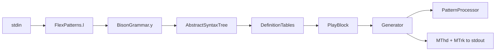

# Orchestra Compiler

A Flex/Bison compiler that accepts programs written in **Orchestra** — a domain-specific language for describing music — and emits **Standard MIDI files** (binary `MThd` + `MTrk` chunks) to stdout.

---

## Authors / Team

- Gerónimo Asin (L.65486) — [gasin@itba.edu.ar](mailto:gasin@itba.edu.ar)
- Andrés Garbarz  (L.65488) — [angarbarz@itba.edu.ar](mailto:angarbarz@itba.edu.ar)
- Santiago Lifischtz  (L.65782) — [slifischtz@itba.edu.ar](mailto:slifischtz@itba.edu.ar)
- Sebastián Nicolás Lee (L.64675) — [slee@itba.edu.ar](mailto:slee@itba.edu.ar)

---

## Course Info


| Field               | Detail                                        |
| ------------------- | --------------------------------------------- |
| **Course**          | Autómatas, Teoría de Lenguajes y Compiladores |
| **Code**            | 72.39                                         |
| **Professor**       | Mario Agustín Golmar                          |
| **Institution**     | ITBA                                          |
| **Year / Semester** | 2026 1C                                       |


---

## Problem Statement / Motivation

Writing music in a general-purpose programming language is verbose and error-prone. Traditional music notation tools are visual and not easily version-controlled or composed programmatically.

This project solves that gap by defining **Orchestra**, a text-based language for music, and building a full compiler pipeline — lexical analysis, syntactic analysis, semantic validation, and code generation — that turns high-level musical constructs (notes, chords, patterns, repeats, tempo/key changes) into a playable **Standard MIDI File**. The result is a reproducible, scriptable way to describe and generate music while applying core compiler-construction techniques from the course.

---

## Features

- **Orchestra language** — declarative syntax for tracks, patterns, instruments, tempo, and key/mode
- **Lexical & syntactic analysis** — Flex scanner + Bison push parser building an AST
- **Semantic analysis** — definition tables, play-block resolution, duplicate-ID checks, channel allocation
- **Full MIDI codegen** — Format 1 Standard MIDI with conductor track (tempo) + instrument tracks
- **Musical constructs supported:**
  - Absolute notes (`C4`), scale degrees (`degree(1, 3)`), GM percussion strings (`"closed_hi_hat"`)
  - Rests, note chords, pattern chords, strum, arpeggio
  - Pattern definitions and references, nested blocks, `repeat`, `step` sequencer
  - Duration expressions (`h/2`, `q dot`, `3*quarter`)
  - Global and local tempo/key overrides (all seven modes)
  - Selective export via `play { track1, track2 };` or `play all;`
- **40 automated tests** — 28 accept, 12 reject (syntax + semantics)
- **Docker-based dev environment** — reproducible build with GCC, CMake, Flex, and Bison
- **CI pipeline** — GitHub Actions runs build + full test suite on push/PR

---

## Tech Stack


| Category          | Technology              |
| ----------------- | ----------------------- |
| **Language**      | C                       |
| **Lexer**         | Flex                    |
| **Parser**        | Bison                   |
| **Build**         | CMake, Make             |
| **Container**     | Docker + Docker Compose |
| **CI**            | GitHub Actions          |
| **Output format** | Standard MIDI File 1.1  |


No external runtime libraries — the compiler is self-contained C with generated Flex/Bison sources.

---

## Project Structure

```
TLA-20261Q/
├── README.md, LICENSE.md                  # docs
├── CMakeLists.txt, compose.yaml           # build & Docker
├── .github/workflows/pipeline.yaml        # CI
├── doc/                                   # Orchestra design documentation
│
├── src/main/
│   ├── bash/                              # build.sh, run.sh, test.sh, flex.sh, bison.sh
│   ├── c/
│   │   ├── EntryPoint.c                   # main entry point
│   │   ├── frontend/
│   │   │   ├── Frontend.c/h               # lexer ↔ parser bridge
│   │   │   ├── lexical-analysis/          # FlexPatterns.l, FlexActions, FlexScanner (generated)
│   │   │   └── syntactic-analysis/        # BisonGrammar.y, BisonActions, AST, BisonParser (generated)
│   │   ├── backend/code-generation/
│   │   │   ├── DefinitionTables.c/h       # Step 1: definition tables
│   │   │   ├── PlayBlock.c/h              # Step 2: play block + channels
│   │   │   ├── PatternProcessor.c/h       # Step 3: AST → MIDI events
│   │   │   ├── Generator.c/h              # Step 4: MThd + MTrk output
│   │   │   ├── util/                      # Buffer, ExpressionEvaluator, MidiEventList, ScaleUtils
│   │   │   └── midi/                      # MidiConstants, MidiEvents, MidiInstruments, MidiNotes
│   │   └── support/                       # Environment, Logger, String, compiler types
│   ├── docker/compiler/Dockerfile
│   └── test/c/
│       ├── accept/                        # 28 valid programs
│       └── reject/                        # 12 invalid programs
│
└── .build/Flex-Bison-Compiler             # compiled binary (created by build.sh)
```

---

## Setup & Installation

### Prerequisites

- [Docker v28.3.2](https://www.docker.com/) (recommended), **or**
- Native: GCC, CMake, Flex, Bison

### Environment Variables


| Name                  | Default | Description                                                                          |
| --------------------- | ------- | ------------------------------------------------------------------------------------ |
| `ENVIRONMENT`         | `Local` | Active environment: `Local`, `Development`, or `Production`                          |
| `LOG_IGNORED_LEXEMES` | `true`  | Log ignored lexemes at `DEBUGGING` level; set `false` to suppress                    |
| `LOGGING_LEVEL`       | `ALL`   | Minimum log level: `ALL`, `DEBUGGING`, `INFORMATION`, `WARNING`, `ERROR`, `CRITICAL` |


Docker Compose reads these from an optional `.env` file (see `compose.yaml`).

### Install & Build

**Option A — Docker (recommended)**

```bash
# Start an ephemeral dev container
docker compose run --rm compiler

# Inside the container:
src/main/bash/build.sh
```

**Option B — Native**

```bash
src/main/bash/build.sh
```

This runs CMake + Make and produces `.build/Flex-Bison-Compiler`.

---

## Usage

Pipe an Orchestra program to the compiler via stdin. MIDI bytes are written to **stdout** — redirect to a `.mid` file to play it:

```bash
# Using run.sh (reads a file and pipes it)
src/main/bash/run.sh src/test/c/accept/03-absolute-note-duration > output.mid

# Or directly
cat src/test/c/accept/03-absolute-note-duration | .build/Flex-Bison-Compiler > output.mid
```

**Exit codes:** `0` = program accepted (MIDI emitted), `1` = syntax or semantic rejection (no MIDI output).

### Minimal program example

**Input** (`src/test/c/accept/03-absolute-note-duration`):

```
track piano {
    instrument "Acoustic Grand Piano";
    C4 quarter;
}
play all;
```

**Output:** A Standard MIDI File (Format 1) with a conductor track (120 BPM default) and one piano track playing middle C for one quarter note.

### Stop Docker session

```bash
exit
docker compose down
```

---

## Architecture / Design




The backend follows a **four-step pipeline**:

1. **Definition tables** — build pattern/track tables; resolve global tempo (default 120 BPM) and key (default C major)
2. **Play block** — mark export tracks; assign MIDI channels (max 16, channel 9 reserved for percussion)
3. **Pattern processing** — translate AST musical constructs to timed MIDI events (absolute ticks; delta-times computed at write)
4. **MIDI serialization** — write `MThd` header + conductor track + one `MTrk` per exported instrument track

**Key design decisions:**

- Iterative AST traversal (no recursion) to handle deeply nested programs safely
- Conductor track (Format 1) carries all Set Tempo meta-events; instrument tracks carry notes and Program Change
- Same GM instrument on multiple export tracks can share one MIDI channel
- Only play-selected tracks are exported to MIDI; semantic validation runs on export-selected tracks only

See [AGENTS.md](AGENTS.md) for the full architecture reference.

---

## Accept Programs

All accept programs live under `src/test/c/accept/`. Highlights:


| File                                  | What it does                                |
| ------------------------------------- | ------------------------------------------- |
| `03-absolute-note-duration`           | Single note with duration                   |
| `04-pattern-declare-and-use`          | Pattern definition + reference              |
| `05-shared-duration-chord`            | Note chord `[C4, E4, G4] half;`             |
| `07-repeat-pattern`                   | `repeat 4 { ... }`                          |
| `09-strum-generator`                  | Strum with staggered note onsets            |
| `10-arpeggio-generator`               | Sequential arpeggio                         |
| `11-scale-degree-notes`               | `degree(1, 3)` in current key/scale         |
| `16-step`                             | Step sequencer                              |
| `18-drum-track-percusion-identifiers` | GM percussion via string IDs                |
| `23-time-expressions`                 | Rich duration math (`h/2`, `q dot`, `2/16`) |
| `27-rachmaninoff-piano-2`             | Multi-pattern real-world piece              |
| `01-heavy-test`                       | Integration test covering all constructs    |


**Pattern reuse example** (`04-pattern-declare-and-use`):

```
pattern motif {
    E4 e;
    G4 e;
    A4 q;
}
track piano {
    instrument "Violin";
    motif;
    motif;
}
play all;
```

---

## Reject Programs

All reject programs live under `src/test/c/reject/`. 


| File                          | Rejection reason                              | Phase    |
| ----------------------------- | --------------------------------------------- | -------- |
| `01-empty-program`            | Empty input                                   | Syntax   |
| `02-missing-semicolon`        | Missing `;` after instrument declaration      | Syntax   |
| `03-note-without-duration`    | Note without duration (`C4;`)                 | Syntax   |
| `04-missing-closing-brace`    | Unclosed `pattern` block                      | Syntax   |
| `05-generator-missing-fields` | Malformed arpeggio (missing total duration)   | Syntax   |
| `06-missing-play-block`       | Tracks defined but no `play` statement        | Syntax   |
| `07-chord-with-inner-wait`    | Duration inside chord note list               | Syntax   |
| `08-wait-in-step-block`       | Duration after note inside `step` block       | Syntax   |
| `09-track-missing-id`         | `track` block without identifier              | Syntax   |
| `10-missing-instrument`       | Export track with no `instrument` declaration | Semantic |
| `11-degree-not-closed`        | Unclosed `degree(` expression                 | Syntax   |
| `12-unknown-play-track`       | Unknown track ID in `play { ... }`            | Semantic |


**Semantic reject example** (`12-unknown-play-track`):

```
track piano {
    instrument "Acoustic Grand Piano";
    C4 q;
}

play { piano, ghost; }   // "ghost" is not defined
```

**Syntax reject example** (`03-note-without-duration`):

```
track piano {
    C4;                    // every note requires a duration
}
play all;
```

---

## Testing

Run the full test suite (40 programs):

```bash
src/main/bash/test.sh
```

Each test pipes a file from `src/test/c/accept/` or `src/test/c/reject/` to the compiler and checks the exit code:


| Suite     | Count | Expected exit code |
| --------- | ----- | ------------------ |
| `accept/` | 28    | `0`                |
| `reject/` | 12    | `1`                |


Reject tests cover syntax errors (missing semicolons, malformed generators) and semantic errors (unknown play track, missing instrument on export track, channel exhaustion, invalid notes/patterns).

---

## Future Work

**Expressive dynamics**

Today every note uses the same MIDI velocity. Adding intensity markings per note, chord, or track section — translated by the backend into different Note On velocities — would significantly improve the sound. Track-level volume or balance events could mark softer or louder passages without rewriting each event individually. Combined with existing generators, this would enable patterns such as decreasing arpeggios or strums with an accent on the first note, without changing Orchestra’s declarative style or the current codegen pipeline.

**Pattern transposition**

A tool to transpose a pattern by a given number of semitones was initially set aside: it complicates degree-to-pitch resolution and MIDI generation, because absolute transposition does not preserve the scale and can push notes outside the valid range. Still, it would automate harmony — a user could define a pattern once and play it both at pitch and transposed (e.g. to build a chord from the same material).

---

## References / Credits

- Back, D. (s. f.). *Standard MIDI-File Format Spec. 1.1, updated*. MIDI Music.  
[https://midimusic.github.io/tech/midispec.html](https://midimusic.github.io/tech/midispec.html)
- Wikipedia. (s. f.). *Mode (music): Modes and scales*. Wikipedia.  
[https://en.wikipedia.org/wiki/Mode_(music)](https://en.wikipedia.org/wiki/Mode_(music))
- Wikipedia. (s. f.). *General MIDI*. Wikipedia.  
[https://en.wikipedia.org/wiki/General_MIDI](https://en.wikipedia.org/wiki/General_MIDI)
- [Flex manual](https://westes.github.io/flex/manual/)
- [Bison manual](https://www.gnu.org/software/bison/manual/)

---

## CI/CD

GitHub Actions runs `build.sh` + `test.sh` on every push and pull request. To enable it in a fork, activate Actions in the repository **Settings** tab with:


| Key                                                        | Value                                               |
| ---------------------------------------------------------- | --------------------------------------------------- |
| `Actions permissions`                                      | `Allow all actions and reusable workflows`          |
| `Allow GitHub Actions to create and approve pull requests` | `false`                                             |
| `Artifact and log retention`                               | `30 days`                                           |
| `Fork pull request workflows from outside collaborators`   | `Require approval for all outside collaborators`    |
| `Workflow permissions`                                     | `Read repository contents and packages permissions` |


### Useful Docker commands


| Command                                 | Description                                 |
| --------------------------------------- | ------------------------------------------- |
| `docker builder prune --all`            | Removes all builds and complete build cache |
| `docker compose --progress=plain build` | Forces a build or rebuild of the images     |
| `docker image prune`                    | Removes dangling images                     |
| `docker network prune`                  | Removes unused networks                     |
| `docker volume prune`                   | Removes unused volumes                      |


---

## Recommended IDE Extensions

- [C/C++](https://marketplace.visualstudio.com/items?itemName=ms-vscode.cpptools)
- [CMake Tools](https://marketplace.visualstudio.com/items?itemName=ms-vscode.cmake-tools)
- [Yash](https://marketplace.visualstudio.com/items?itemName=daohong-emilio.yash) (Flex/Bison syntax highlighting)

